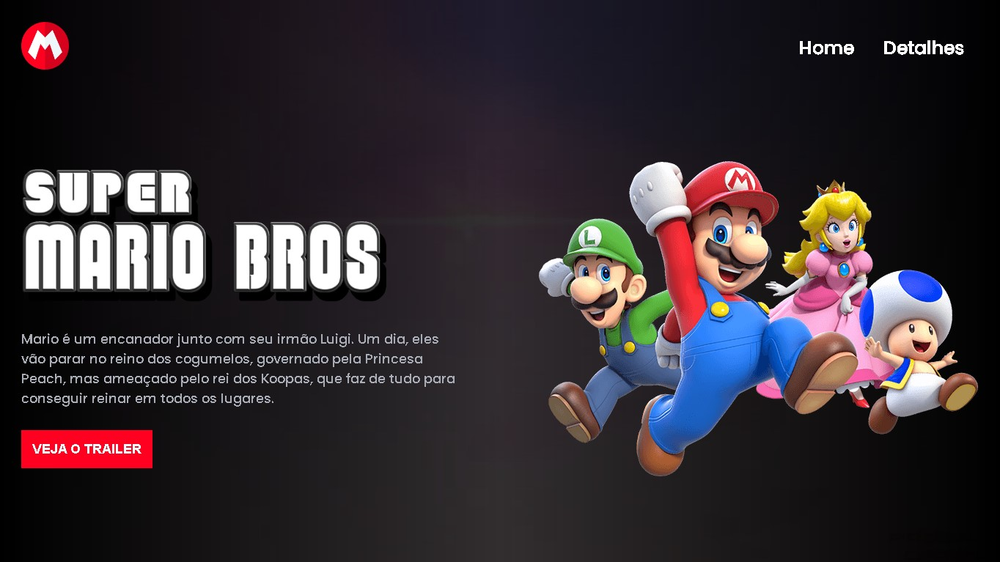

# Projeto Mario Dev em Dobro

<h1 align="center"> Projeto Mario </h1>

Programa exclusivo e gratuito, promovido pelo Dev em Dobro para ensino de tecnologias WEB.  
<a href="https://www.youtube.com/@DevemDobro">Estude esse projeto em formato de vídeo clicando aqui.</a>

  <a href="#-tecnologias">Tecnologias</a>&nbsp;&nbsp;&nbsp;|&nbsp;&nbsp;&nbsp;
  <a href="#-projeto">Projeto</a>&nbsp;&nbsp;&nbsp;|&nbsp;&nbsp;&nbsp;
  <a href="#-layout">Layout</a>&nbsp;&nbsp;&nbsp;|&nbsp;&nbsp;&nbsp;
  <a href="#memo-licença">Licença</a>

  

 

  

## 🚀 Tecnologias

Esse projeto foi desenvolvido com as seguintes tecnologias:

- HTML e CSS
- JavaScript
- Git e Github

## 💻 Projeto

O DevLinks é um agregador de links para usar como cartão de visitas online.

- [Acesse o projeto finalizado, online](https://ibaptiista.github.io/DevLinksRocketseat/)

## :memo: Licença

Esse projeto está sob a licença MIT.

---

Feito com  by Ícaro Batista (aula dos Gêmeos Dev em Dobro)